# Project_1: Analysing Stock Performance and Sentiment

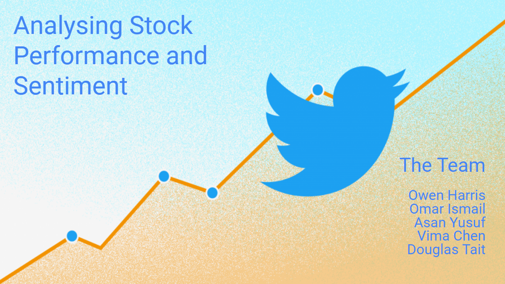

## Introduction

For this project we aimed to find out if social media sentiment, news sentiment and social media engagement have correlations with stock market price movements. Do human emotions that are  broadcast online, through text-based messages such as those on Twitter, influence the buying and selling patterns of others? Is the network effect of media amplifying market behaviours such as loss-aversion or FOMO (Fear of Missing Out)? We also wondered if analysis of this data could be incorporated into a buying and selling strategy for stock market investment.

So, what is sentiment data? Sentiment analysis (or opinion mining) is a Natural Language Processing technique (which is a field of Artificial Intelligence) used assign a score, or grading, indicating whether the sample text is positive, negative, or neutral. Although it isn’t just a tally of good and bad words, it also attempts to understand the syntax and sentence construction around those words. It allows us to view the sentiment of huge samplings of text, more than what humans could sort through individually, and find patterns around different groupings, like hashtag mentions.

In our initial research we identified the [Finance and Social Sentiment for Twitter API](https://rapidapi.com/UtradeaAPI/api/finance-social-sentiment-for-twitter-and-stocktwits/) on [rapidapi.com](https://rapidapi.com/hub) that gives a real-time feed of sentiment scores for individual tweets that mention stock market tickers. It also has feeds that group this information with changes in the stock price for up to 200 tickers across specified timeframes. We also used [News API](https://newsapi.org/) to source news headlines by stock ticker and then had those headlines analysed by [Vader Lexicon](https://www.kaggle.com/datasets/nltkdata/vader-lexicon) a lexicon and rule-based sentiment analysis tool for Python.

In order find out if there were correlations in the data, we broke the analysis into 5 main tasks:

-	Comparing Correlations Across Different Timeframes.
-	Comparing Correlations in Bullish and Bearish Sentiment.
-	Comparing Different Kinds of Twitter Engagement.
-	Comparing Correlations Across Different Market Capitalisation. 
-	Comparing Correlations Across Market Sectors.
 

## Technologies
Modules and libraries required to run the Jupyter Notebook files:

Requests, Json, Pandas, Holoviews, Pathlib, Numpy, Seaborn, Matplotlib, and Vader Lexicon.

Follow [this link](https://owen-fintech-projec-streamlit-dashboard01---introduction-at4bu7.streamlitapp.com/) to view the project dashboard created with Streamlit.

# Analysis

## Comparing Timeframes Part 1

For this section of the project, I have created visualisations in order to see how the correlations between sentiment change and price change differ when data is collected for different lengths of time. I requested data from the API on 24hr, 72hr, 1 week, 2 week, 1 month and 3 month timeframes for both of the top 200 most bullish tickers (ordered by positive change in sentiment) and the top 200 most bearish tickers (ordered by negative change in sentiment).

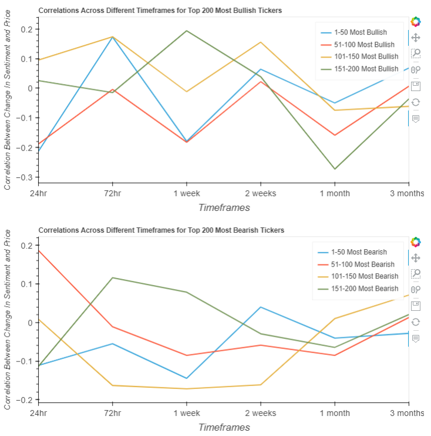

Conclusions are not easy to make from these two plots unfortunately. There clearly is a lot of divergence between the different quartiles. There is no easily discernable trend in the different correlations according to timeframe on these plots. One observation we can make though is that the top quartile of the of the top 200 tickers according to change in sentiment does not consistently have a higher correlation than the lower quartiles.

This leads me to hypothesize that tickers that have the most change in sentiment are not necessarily very reliable points of data. Upon examining the dataframe I found some huge changes in sentiment, this might be happening for more obscure tickers where a miniscule amount of tweets (or most likely, a single tweet) will create these big swings in the sentiment score averages. As a way to counteract this, I decided I would filter the top 200 tickers by change in sentiment to only include those that also appear in the top 200 highest trending tickers. It follows that if a ticker is on the trending list, it won't have a tiny amount of tweets.

So, for part 2 of my analysis I modified my scripts to filter out the non-trending tickers.

## Comparing Timeframes Part 2

For this second part I will be examining the same 24hr, 72hr, 1 week, 2 week, 1 month and 3 month timeframes but instead of dividing the tickers into quartiles I will be filtering out the non-trending tickers.

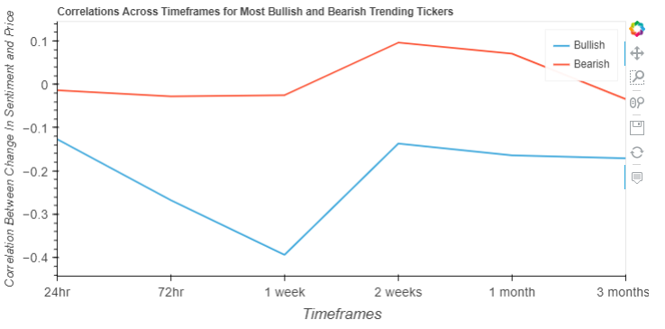

This plot provides greater opportunity to draw conclusions than the busy plots created in part 1. We can see that for all the different timeframes plotted, bearish sentiment had a higher correlation than bullish sentiment. We can see this peaking at the 2 weeks timeframe, so that would be the optimal span of time for sentiment data collection.

## Comparing Bullish and Bearish Sentiments

In this section, we are trying to analyse and plot the top 50 tickers by bullish and bearish sentiments and their correlation with the change in price.

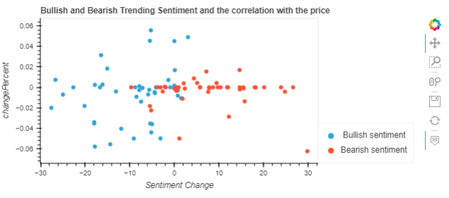

As we can see, in general the change in price is too small in both bullish and bearish sentiment to assume there is an actual correlation. But for comparison purposes the bearish sentiment correlates with more bearish change in price.

## Comparing Twitter Engagement

For this section of the project, we have created visualisations to show the correlations between the different kinds of Twitter engagement: posts, likes, impressions (or views) and retweets with the changes in the price of the top 200 trending tickers.

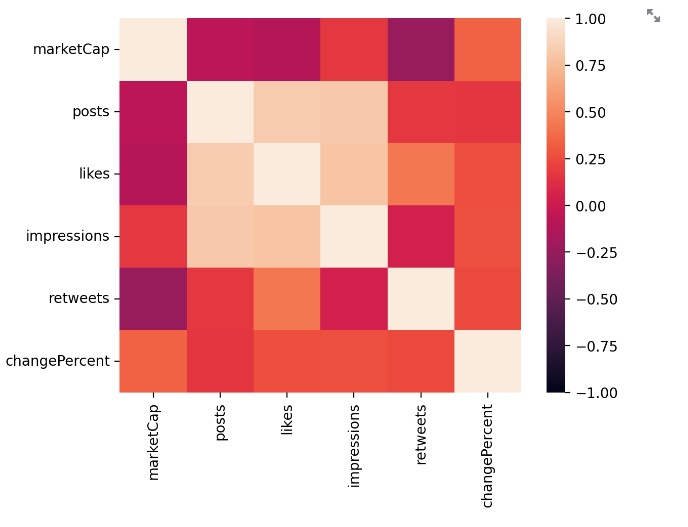

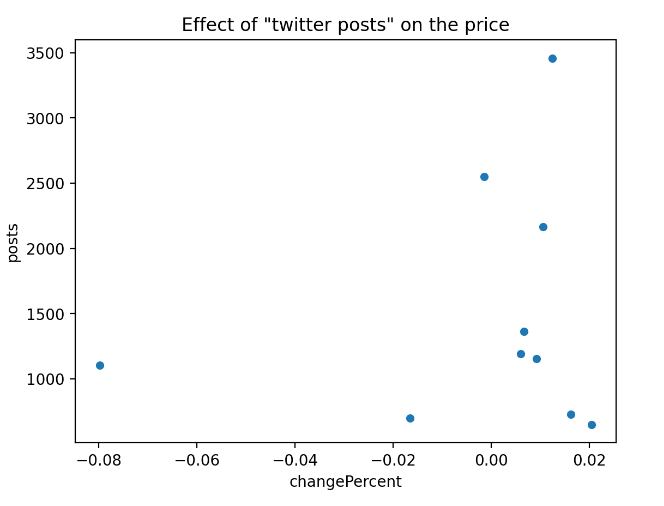

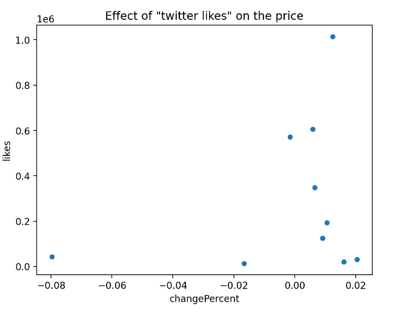

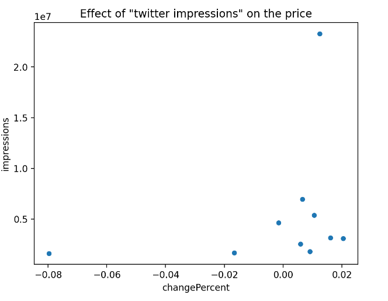

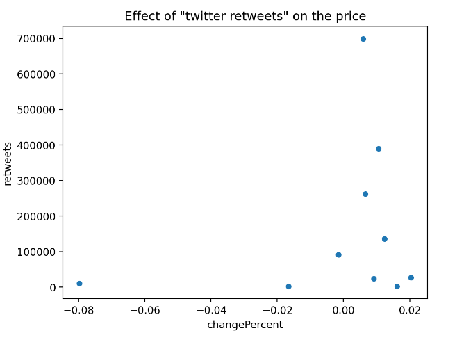

Comparing scatter plots on each kind of twitter engagement, we can see that it is difficult to confirm there is a very strong correlation on the positive price movement from the volume of twitter engagement. In contrast, negative price movement is strongly correlated to the volume of twitter engagement.

## Market Cap Correlation

Across different size of market capitalizations, we will analyze if there is any correlation between sentiment change and market cap. For my dataset, I used the 200 companies with the most bullish and most bearish sentiment changes in the last 72 hours, since 72 hours is a reasonable time period for investors to absorb information and take action in the market. The correlation analysis will be examined respectively for large-cap (market cap > 10 billion), medium-cap (market cap between 2 billion and 10 billion) and small-cap (market cap < 2 billion). This allows us to investigate the relationship between social media sentiment and share price fluctuation in various contexts.

### Correlation Comparison for Different Market Caps in Bullish Sentiment

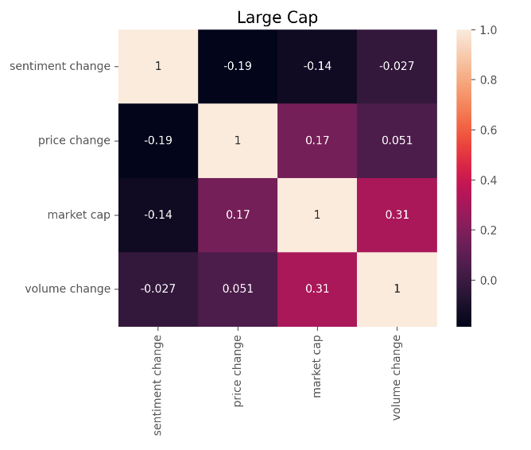

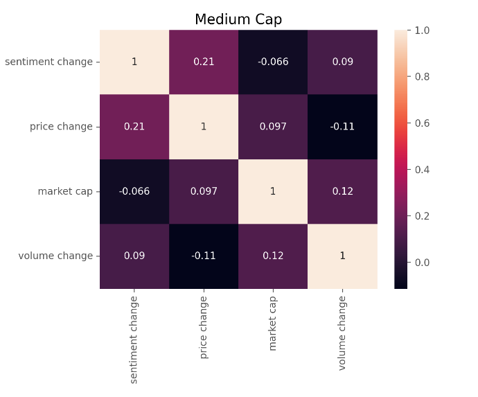

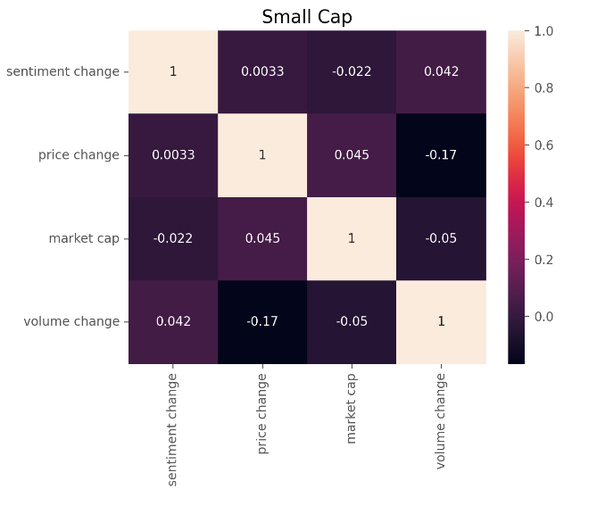

### Findings

By comparing the three market cap correlation vs bullish sentiment matrix, we found that the correlations across all three markets are all very weak.

Med cap stocks are relatively more sensitive to sentiment changes. In medium cap market, price is more sensitive to sentiment change comparing to volume. The positive sentiment change gave a little push to the stock prices in med cap market. Most of the med cap companies didn't act efficiently with the sentiment change, there are only a few stocks had dramatic change in price and volume, which means the social media sentiment influence more in an individual stocks than the whole market.

### Correlation Comparison for Different Market Caps in Bearish Sentiment

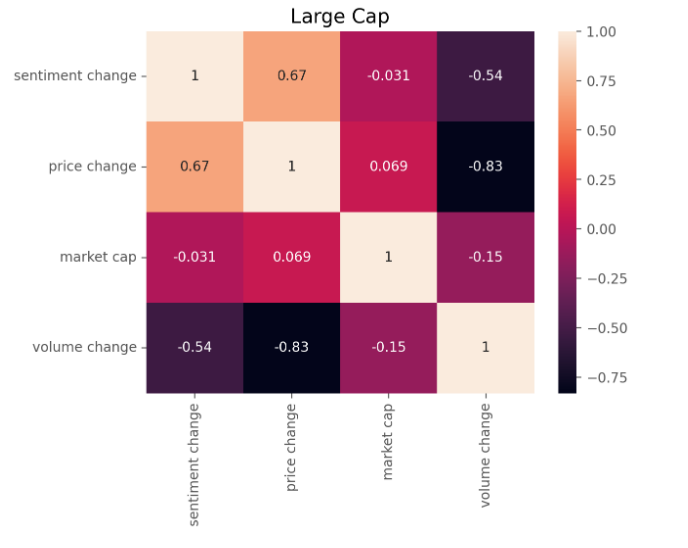

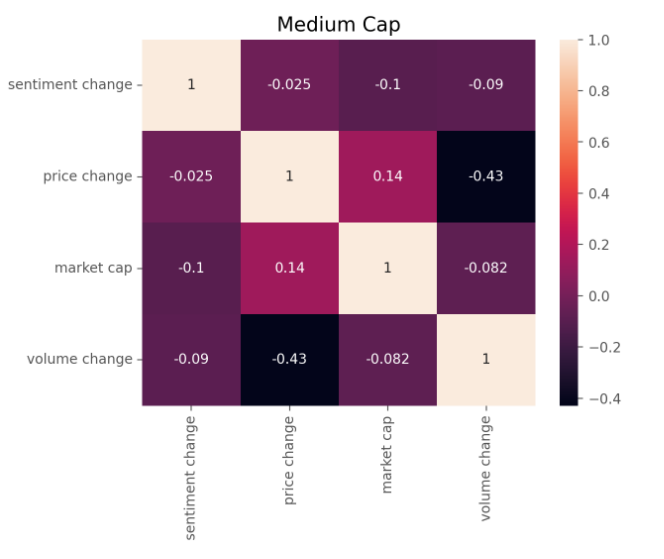

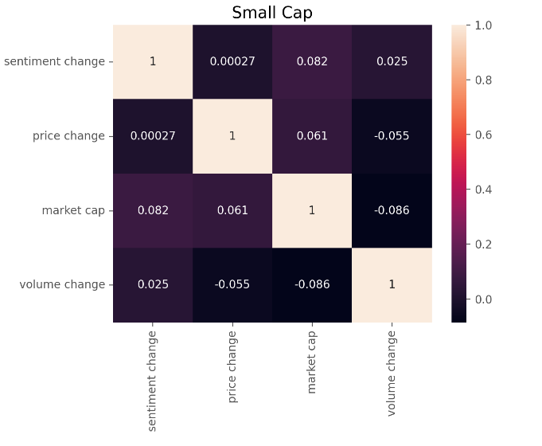

## Market Cap Conclusions

From the marix above, we can find that the large cap has stonger correlation with the negative sentiment change. Price decreased on increasing volume change along with the negative sentiment change. In bullish sentiment analysis, it shows that the large cap had a slight price decrease even with the positive sentiment. It is a clear sign that the investors are now at a high level of pessimism.

Over time, large-cap, med-cap, and small-cap stocks have taken turns leading the market as each can be affected differently by market or economic developments. That's why many investors diversify, maintaining a mix of market caps in their portfolios. When large caps are declining in value, small caps or med caps may be on the way up and could potentially help compensate for any losses.

To build a portfolio with a proper mix of small-cap, med-cap, and large-cap stocks, you'll need to evaluate your financial goals, risk tolerance, and time horizon. A diversified portfolio that contains a variety of market caps may help reduce investment risk in any one area and support the pursuit of your long-term financial goals.

However, the correlations with the three markets are all very weak. Analysis of market cap correlation does not suffice as a determining factor in investment strategy. Obviously, it's better to use sentiment analysis when we evaluate a specific stock or industry.

## Analysing 3 blue chip stocks in different industries against media sentiment

For this project, 3 blue chip stocks were analysed over the period of a month. The project was to assessed if sentiment analysis could play a pivotal role in forecasting stock activity. Initially the data was

## Hypothesis

Sentiment from media does not create stock volatility for blue-chip stocks, and should not be used as a driver to predict movements.

## So how did we approach this analysis?

During this section of the analysis, blue-chip stocks were isolated against newsfeed. The newsfeed was source from NewsAPI, where it provided 30-days of searches for free.

VADER Sentiment Analysis was used to analyse the newsfeed. VADER = Valence Aware Dictionary and sEntiment Reasoner is a lexicon and rule-based sentiment analysis tool that is specifically attuned to sentiments expressed in social media, and works well on texts from other domains.

## Apple Inc

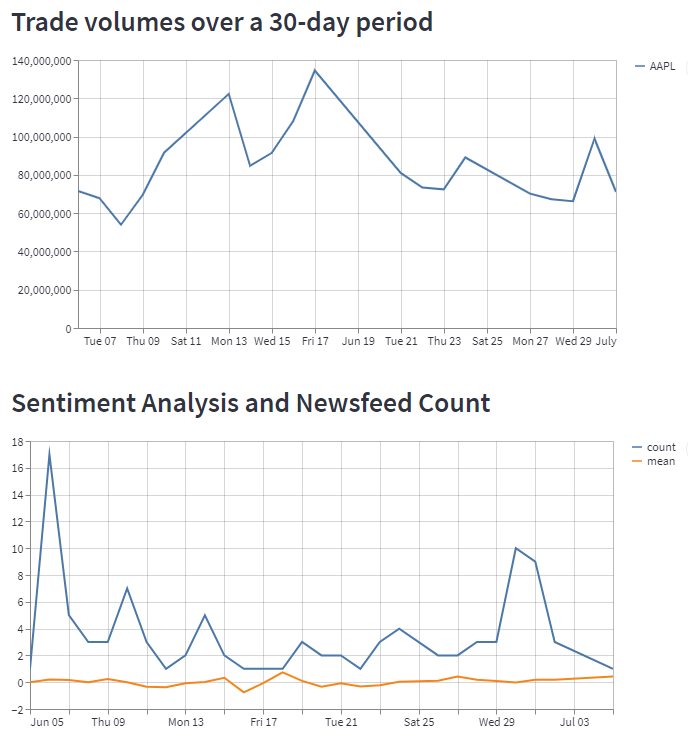

## Summary of findings from analysing Apple Inc

There was no correlation in trading volumes and the newsfeed sentiments for Apple. While there was a significant amount of newsfeeds for the period, reaching a count of 17 newsfeed globally on 06 June 2022, the volume of trade days was one of the lowest for the period.

## JP Morgan

Media feeds collected from NewsAPI for the previous 30-days.

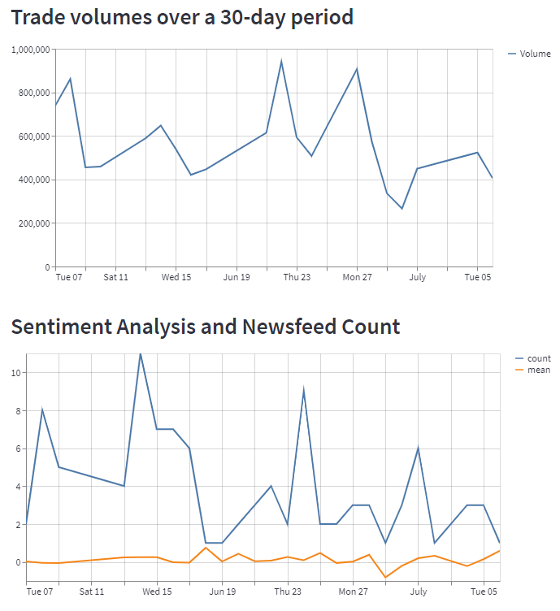

## Jones Lang Lasalle

Media feeds collected from NewsAPI for the previous 30-days.

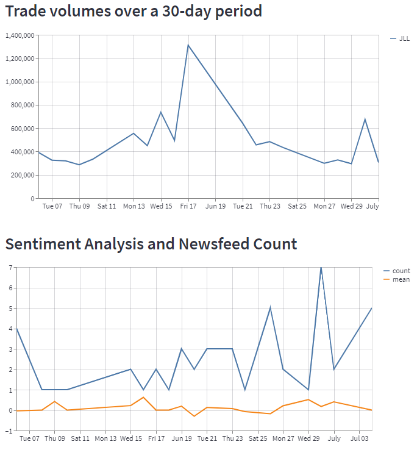

# Conclusions

While we did find some small degrees of correlation between sentiment and price movement in some specific subsets of the data, the overall picture we got was that sentiment data couldn’t be consistently relied upon as an indicator of price movement. Therefore, we would not recommend that sentiment analysis be included as part of a trading strategy. One of the main problems is that the small degrees of correlation we found do not amount to causation. In other words, these sentiment scores are just as likely to be a reaction to price movement in the market than they are a predictor of that movement. Furthermore, Twitter users that include stock tickers in their hashtag mentions are a niche within the overall community of Twitter users. So, a tweet commenting on a company in general may contain valuable sentiment but unfortunately it wouldn’t be analysed by a stock sentiment API if it doesn’t also include the company ticker in the hashtag mentions.

There were topics of analysis that emerged during the project that may be worthy of further investigation. For example, we looked at news sentiment and twitter sentiment but what is the relationship between them? Can news headlines simply be categorized as highly influential tweets, for the purpose of analysis? Or do news reports precede the reactions of the public in their timing and therefore better predict the price changes than tweets? Also, would sentiment data that is collected from particularly influential or trusted Twitter users be more correlated than data that is simply collected from anyone and which potentially includes spam accounts?  
 

## The Team

Owen Harris

Omar Ismail

Asan Yusuf

Vima Chen

Douglas Tait

